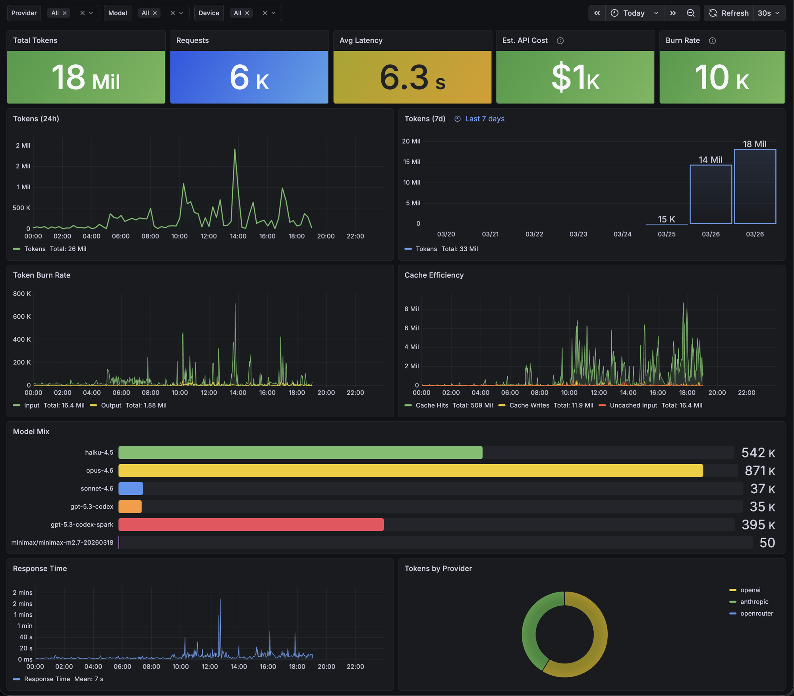

<p align="center">
  <h1 align="center">toktap</h1>
  <p align="center">
    You can't optimize what you can't see.
    <br />
    <em>Track every token across every AI tool. ~0.1ms overhead.</em>
  </p>
  <p align="center">
    <a href="https://github.com/voska/toktap/actions/workflows/ci.yml"></a>
    <a href="https://goreportcard.com/report/github.com/voska/toktap"></a>
    <a href="LICENSE"></a>
  </p>
</p>

---

toktap is a transparent proxy that sits between your AI tools and the provider API. It extracts token usage from SSE streams — zero-copy, zero-buffering — and writes metrics to InfluxDB. Your tools don't know it's there.

```
┌──────────────┐         ┌──────────┐         ┌──────────────┐
│  Claude Code │────────▶│          │────────▶│  Anthropic   │
│  Codex CLI   │         │  toktap  │         │  OpenAI      │
│  Any SDK     │◀────────│          │◀────────│  OpenRouter  │
└──────────────┘         └────┬─────┘         │  xAI         │
                              │               └──────────────┘
                              ▼
                         ┌──────────┐
                         │ InfluxDB │──▶ Grafana
                         └──────────┘
```

<p align="center">
  
</p>

## Performance

toktap adds **~0.1ms** per request. A typical Claude Opus response takes 5-30 seconds — the proxy adds <0.001% latency. SSE streams are tapped zero-copy: bytes flow to the client while a side-channel scanner extracts usage.

```
BenchmarkDirectVsProxy/direct     63,530 ns/op
BenchmarkDirectVsProxy/proxied   189,221 ns/op  ← ~0.13ms overhead
BenchmarkSSEPayloadSizes/10       85,827 ns/op
BenchmarkSSEPayloadSizes/100     117,435 ns/op
BenchmarkSSEPayloadSizes/1000    375,794 ns/op
```

Run benchmarks yourself: `go test -bench=. -benchmem ./internal/proxy/`

## Quick Start

```bash
git clone https://github.com/voska/toktap.git && cd toktap
docker compose up -d
```

That's it. InfluxDB, Grafana, and the proxy are all running. Open [localhost:3000](http://localhost:3000) for the dashboard.

Now point your tools at the proxy:

```bash
# Claude Code / Anthropic SDK
export ANTHROPIC_BASE_URL=http://localhost:8080/anthropic

# Codex CLI / OpenAI SDK
export OPENAI_BASE_URL=http://localhost:8080/openai/v1

# Tag requests by machine (optional)
export ANTHROPIC_EXTRA_HEADERS="X-Device: macbook"
```

## Why

> *"You have to use tokens aggressively to create something remarkable. You have to let it rip."*
> — [Garry Tan](https://x.com/garrytan/status/1904984898382610636)

I built toktap because provider dashboards only show API usage — not aggregated token consumption across providers, devices, or tools. They don't show me when I was productive or how my usage breaks down.

I have subscriptions with Anthropic and OpenAI. I don't want to use fewer tokens. I want to use more of them. But I want to see where they're going — not to cut back, but to make sure I'm actually putting them to work.

If I'm only burning tokens 9 to 5, something's wrong.

## Providers

Routes are configured in YAML. Adding a provider is a config change, not a code change.

```yaml
# deploy/config/routes.yaml
routes:
  anthropic:
    upstream: https://api.anthropic.com
    provider: anthropic

  openai:
    upstream: https://api.openai.com
    provider: openai
    inject_stream_options: true   # get usage in streaming responses

  codex:
    upstream: https://chatgpt.com/backend-api/codex
    provider: openai
    chrome_transport: true        # Chrome TLS fingerprint for Cloudflare
```

| Field | What it does |
|-------|-------------|
| `upstream` | Where to forward requests. Base path is prepended automatically. |
| `provider` | Canonical name in metrics. Multiple routes can share one. |
| `inject_stream_options` | Adds `include_usage: true` to streaming requests (OpenAI format). |
| `chrome_transport` | Mimics Chrome's TLS fingerprint to bypass Cloudflare Bot Management. |

## What Gets Tracked

Every request produces a structured JSON log and an InfluxDB data point:

| Field | Source | Examples |
|-------|--------|---------|
| `provider` | Route config | `anthropic`, `openai`, `openrouter` |
| `model` | Response SSE / body | `claude-opus-4-6`, `gpt-5.4` |
| `device` | `X-Device` header | `macbook`, `workstation`, `server` |
| `harness` | User-Agent | `claude-code`, `codex`, `sdk` |
| `input_tokens` | Usage data | `25`, `100`, `50000` |
| `output_tokens` | Usage data | `10`, `500`, `2000` |
| `cache_read_tokens` | Usage data | `95000` |
| `cost_usd` | Pricing config | `0.27` |

## How It Works

1. Request hits `/<route>/path` — route prefix is stripped, forwarded upstream
2. **Streaming:** `TapReader` wraps the response body. Bytes flow to the client while a side-channel SSE scanner extracts usage events. Zero buffering, zero latency.
3. **Non-streaming:** Response body is read once, usage extracted, original body forwarded
4. Usage is written to InfluxDB asynchronously — the client never waits

The proxy is invisible. Clients get the exact same bytes they'd get hitting the provider directly.

## Cost Tracking

Optional. Drop a pricing config and toktap calculates cost per request:

```yaml
# deploy/config/pricing.yaml
models:
  claude-opus-4-6:
    input_per_m: 15.00
    output_per_m: 75.00
    cache_read_per_m: 1.875
    cache_creation_per_m: 18.75
```

Pricing reloads every 60 seconds — update the file, no restart needed.

## Deployment

The default `docker-compose.yaml` includes InfluxDB and Grafana with a pre-loaded dashboard. For production, use a `docker-compose.override.yaml` to customize networking, memory limits, and reverse proxy labels.

toktap is also a single static binary — run it standalone and point it at your own InfluxDB:

```bash
make build
INFLUXDB_URL=http://your-influxdb:8086 INFLUXDB_TOKEN=... ./bin/toktap
```

Graceful shutdown on SIGTERM — in-flight SSE streams drain before exit (5 min timeout).

## Proxy Support

Both [Anthropic](https://docs.anthropic.com/en/api/client-sdks) and [OpenAI](https://platform.openai.com/docs/api-reference) SDKs have built-in support for custom base URLs (`ANTHROPIC_BASE_URL`, `OPENAI_BASE_URL`), which is the mechanism toktap uses.

## Development

```bash
make test    # tests with race detector
make lint    # golangci-lint
make build   # build to bin/ with version embedding
```

## License

[MIT](LICENSE)
